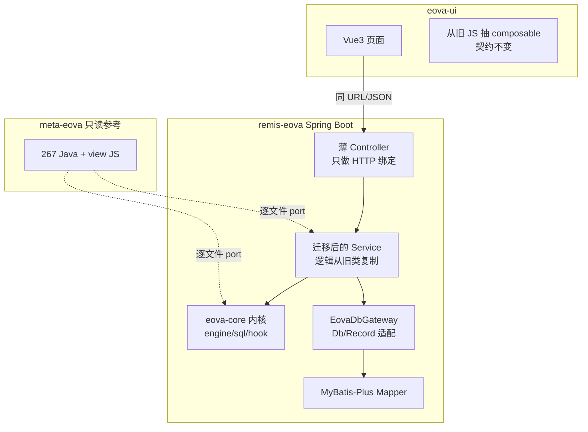

# DES-002-R1 代码级迁移方法论（修订）

> 版本：2026-08-29  
> 背景：拿哥指出原 DES-002 偏「新栈重写」，达不到**代码级迁移**（逻辑/design 一致，只换底座）。本文修订迁移路线。  
> 主方案仍见：`DES-002-meta-eova-tech-stack-migration.md`

---

## 1. 问题诊断：原方案差在哪

| 原 DES-002 写法 | 实际效果 | 为何不算代码级迁移 |
|-----------------|----------|-------------------|
| `WidgetManager → 拆 3 个 Service` | 按理解重写 | 745 行业务规则会丢/变 |
| `MetaController → MetaAdminController` | 新写 Yudao CRUD | 797 行含大量 EOVA 特有分支 |
| `Model → DO + 全新 Mapper` | 数据层重建 | 与 ActiveRecord 查询语义可能不一致 |
| `Enjoy → Vue SFC 重写` | UI 重做 | `/grid/`、`/api/meta/` 契约未冻结 |
| 按「表数/Controller 数」排任务 | 无文件级追溯 | 无法证明「迁的是同一段代码」 |

### 1.1 代码耦合实况（meta-eova/core）

| 指标 | 数量 |
|------|------|
| Java 文件 | **267** |
| 直接 `import com.jfinal` | **149**（56%） |
| 依赖 `Db` / `Record` / `Model` | **遍布** Service、Widget、Model、Controller |
| 前端硬编码旧路径 | `/grid/*`、`/api/meta/*`、`/meta/*` 等 |

结论：**不能**假设「换框架 + 按功能清单重写」= 代码级迁移。必须 **逐文件/port + 契约对齐 + 行为对照**。

---

## 2. 什么是本项目的「代码级迁移」

满足以下 **全部** 条件，才算一个类/接口迁移完成：

1. **可追溯**：旧路径 `cn.eova.xxx.Yyy` → 新路径有明确 1:1（或 1:N 拆分有清单）。
2. **逻辑同源**：核心算法/分支从旧代码 **移植**（允许只改基础设施调用，不允许按记忆重写）。
3. **契约一致**：对外 URL、请求参数、响应 JSON 结构与旧版 **兼容**（或文档化 breaking 且有意为之）。
4. **可验证**：有 golden case（旧 demo 跑一遍录响应，新服务同样请求 diff 通过）。

**换技术栈**体现在：JFinal→Spring、Db→MyBatis 适配层、Enjoy→Vue 壳；**不换**的是：元数据规则、表达式语义、Widget 查询拼装、权限 URI 模型。

---

## 3. 修订后的迁移架构：内核 + 适配层 + 薄壳



### 3.1 关键：先建 `EovaDbGateway`，再迁业务

旧代码大量：

```java
Db.use(ds).find(sql, paras);
Record r = Db.findFirst(...);
object.getFields(); // Model 缓存查询
```

**代码级迁移动作**：不是把每处 SQL 改写成 Mapper，而是：

1. 定义 `EovaDbGateway` / `EovaRecord`（对齐 JFinal `Db`/`Record` 最小子集）。
2. 实现 `MyBatisEovaDbGateway`（内部用 MP + 动态 SQL）。
3. **WidgetManager、MetaService 等方法体尽量原样复制**，只把 `Db.` → `EovaDbGateway.`。

这样 745 行的查询拼装、权限列过滤 **语义不变**。

### 3.2 模块划分（remis-eova 仓库内）

```
remis-eova/
├── backend/
│   ├── eova-core/              # 框架无关内核（从 meta-eova port）
│   │   ├── engine/             # EovaExp, SqlParse — 先去 JFinal Kv/LogKit
│   │   ├── sql/                # dql/ddl dialect
│   │   ├── hook/               # HookRegistry
│   │   └── model/domain/       # 纯 POJO（从 Model 抽字段，去 AR 继承）
│   ├── eova-db-adapter/        # EovaDbGateway + MyBatis 实现
│   ├── yudao-module-eova-biz/  # Spring Service + Controller（port 旧类）
│   └── yudao-module-eova-api/  # 对外 DTO（后期再拆，前期可省略）
└── fornt/eova-ui/
```

---

## 4. 267 个 Java 文件的迁移分级

| 级别 | 含义 | 约估数量 | 做法 |
|------|------|----------|------|
| **A 直迁** | 无 JFinal 依赖 | ~118 | 复制到 `eova-core`，改 package |
| **B 适配迁** | 仅 Db/Record/Kv/LogKit | ~80 | 复制 + 替换为 Gateway / slf4j / Map |
| **C 壳层迁** | Controller/Interceptor | ~27 | 方法体 delegate 到 port 后的 Service |
| **D 重写** | 纯 JFinal 胶水 | ~22 | EovaConfig、Render、Plugin — 用 Spring 配置等价替换 |
| **E 暂缓** | Mod ClassLoader 等 | 少量 | 不在 MVP |

> 下一步 DES-002-R2：生成 **267 行完整对照表**（旧路径/新路径/级别/状态/负责人）。

---

## 5. 前端：也是代码级，不是换皮

| 策略 | 说明 |
|------|------|
| **契约冻结** | 先导出旧系统全部 API 路径 + 样例 JSON（`/api/meta/table/{code}` 等） |
| **JS→TS 移植** | `eova.table.js`、`eova.template.js` 等 **按函数 port** 为 composable，URL 不变 |
| **UI 组件映射** | Layui/EovaUI 控件 → Element Plus，但 **props/事件/数据结构** 与旧版一致 |
| **页面** | `_view/template/table/index.js` 逻辑迁移，不是只画一个 EP 表格 |

**MVP 可选捷径**（仍算代码级）：eova-ui 先 **代理旧静态 JS** + 新后端，再逐文件替换 JS — 但后端必须先契约兼容。

---

## 6. 修订后的阶段规划

| 阶段 | 目标 | 验收（代码级） |
|------|------|----------------|
| **P0** | API 契约清单 + golden 用例录制 | 旧 demo 50+ 关键请求有 baseline JSON |
| **P1** | `eova-core` + `eova-db-adapter` | EovaExp/WidgetManager 单测与旧版输出一致 |
| **P2** | port Service 层（Meta/Form/Auth/Login） | 对照表 B 类文件 ≥80% Done |
| **P3** | port Controller → Spring 薄壳 | 同一 URL golden diff 通过 |
| **P4** | port 前端 JS → Vue composable | 3 个模板页（table/tree/form）行为一致 |
| **P5** | Yudao 基础设施（Nacos/Gateway/Redis） | 部署形态对齐 platform |
| **P6** | DES-003/004 整合 | 身份/嵌入 yudao-ui |

**原 DES-002 的 Phase 1「先搭 Yudao 空壳」降为 P5** — 空壳无法验证代码级迁移。

---

## 7. 迁移进度表（新口径）

| 维度 | 总数 | 已迁移 | 进度 |
|------|------|--------|------|
| Java 文件对照 | 267 | 0 | 0% |
| A 直迁 | ~118 | 0 | 0% |
| B 适配迁 | ~80 | 0 | 0% |
| C 壳层迁 | ~27 | 0 | 0% |
| API golden cases | ~50（待录） | 0 | 0% |
| 前端 JS 模块 | ~15 核心 | 0 | 0% |

---

## 8. 与原 DES-002 任务的关系

| 原任务 | 修订后 |
|--------|--------|
| LC-001 搭 Yudao 空壳 | 降为 **LC-010**（P5）；P1 先做 **LC-011 eova-core** + **LC-012 db-adapter** |
| LC-201 MetaService 重写 | 改为 **LC-201-PORT** 从旧 `MetaService.java` 复制+适配 |
| LC-202 WidgetManager 重写 | 改为 **LC-202-PORT** 从旧 `WidgetManager.java` 复制+适配 |
| LC-301 新 Controller | 改为 **LC-301-PORT** 旧 Controller 方法逐条 delegate |
| VAL-202 | 必须 **golden diff**，不能只看「能登录」 |

---

## 9. 下一步（需拿哥确认）

1. **是否认可本修订路线**（内核+适配层+逐文件 port，而非 Yudao 范式重写）？
2. 若认可，先做 **DES-002-R2**：267 文件完整对照表 + 50 条 golden API 清单。
3. **LC-011**（eova-core 抽内核）替代 LC-001 成为首个 Ready 任务。

---

## 10. 诚实边界

即使代码级迁移，以下部分仍无法「自动转换」，只能 **等价重写**（但范围可控）：

- `EovaConfig extends JFinalConfig`（640 行）→ Spring `@Configuration` 分拆
- 20 个 `Render` 类 → Spring `ResponseEntity` / 流式下载
- JFinal `Interceptor` 链 → Spring Filter/Interceptor

这些归入 **D 类**，数量少，且不影响 Widget/Meta 核心逻辑。

---

## 11. 前端同口径方案

详见 **`DES-002-R1-frontend-code-level-migration.md`**：

- 前端 132 个 JS/Vue/HTML 资产先按 DES-002-R2-F 分类；完成分类后再对业务子集逐文件 port（F-A~F-G 分级），不得沿用旧的“55 个业务 JS”估算
- 契约冻结：`window.urls`、`{ state, msg, data }`、`uzoo.page` 字段
- 阶段 FP0~FP7，任务 FE-001~FE-010
- 与 **DES-002-R2** golden API 清单共用 baseline
