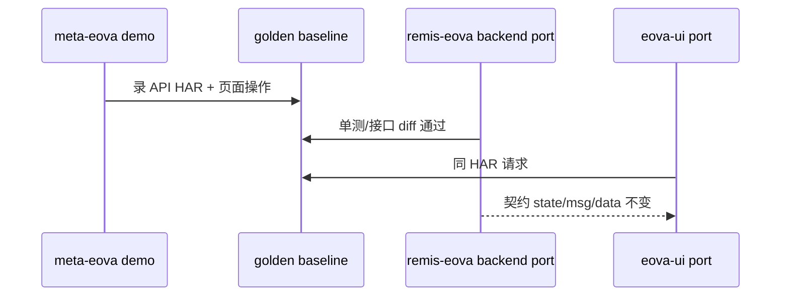

# DES-002-R1-F 前端代码级迁移方案

> 版本：2026-08-29  
> 与后端 **`DES-002-R1-code-level-migration.md`** 同口径：逻辑同源、契约一致、逐文件可追溯、golden 可验。  
> 落点：**`remis-eova/fornt/eova-ui/`**（独立站，后续 DES-004 再嵌 yudao-ui）

---

## 1. 前端现状盘点

### 1.1 资源分布

| 来源 | 路径 | 文件约数 | 说明 |
|------|------|----------|------|
| 平台 UI | `meta-eova/eova/view/.../webapp/eova/` | **113** | 打进 `eova-meta-view` JAR |
| Demo 扩展 | `meta-eova/eova/demo/src/main/webapp/` | **25** | 自定义组件/主题/业务页 |
| 第三方 | `lib/vue/*`、`lib/eova/*` | ~10 | 需换 npm，不 port  min 文件 |

### 1.2 技术栈现状（不是从零开始）

| 层 | 现状 | 迁移含义 |
|----|------|----------|
| 框架 | **Vue 3**（`vue.global.js`，已有 `createApp` + `setup`） | **可代码级 port**，不是 jQuery 老站 |
| UI 库 | **EovaUI**（封装 Layui-Vue）+ `eovaui.js` 压缩包 | 换 **Element Plus 壳**，**保留组件 props/事件语义** |
| 工具 | **EovaTools**（`eova-tools.umd.js`） | port 为 `src/utils/eova-tools/` 或 npm 包 |
| 模板 | **Enjoy** `#include` + 内联 `uzoo.page` 注入 | 改为 **Vue SFC + route meta**，注入改 Pinia/props |
| HTTP | **axios**；响应 `{ state, msg, data }` | **契约冻结**（见 §3） |
| 遗留 | `ui/ext/eova.table.js`（788 行，**jQuery**） | 必须 port 逻辑，不能只用 EP 表格重写 |

### 1.3 核心 JS 体量（业务逻辑所在）

| 旧文件 | 行数 | 角色 |
|--------|------|------|
| `ui/ext/eova.table.js` | 788 | 表格 Widget 核心（jQuery 遗留） |
| `ui/ext/eova.layer.js` | 335 | 弹层 |
| `_view/template/table/index.js` | 317 | 单表模板页逻辑 |
| `_view/template/tree/index.js` | 291 | 树模板 |
| `_view/index/index.js` | 289 | 主框架/菜单 Tab |
| `_view/template/tree_table/index.js` | 211 | 树表模板 |
| `_view/meta/edit/app.js` | 166 | 元对象编辑 |
| `_view/meta/import/app.js` | 145 | 元数据导入 |
| `_view/template/eova.template.js` | 139 | 模板公共按钮 |
| `ui/ext/eova.form.js` | 68 | 表单扩展 |

**合计自研业务 JS（不含 min 库）≈ 55 个文件、~3500 行** — 这是前端代码级迁移的主战场。

---

## 2. 什么叫前端的「代码级迁移」

与后端 R1 四条一致：

| # | 要求 | 前端具体含义 |
|---|------|--------------|
| 1 | 可追溯 | 每个旧 `.js` → 新 `.vue` / `.ts` 有对照行 |
| 2 | 逻辑同源 | `onAdd`/`onQuery`/表格列宽保存等 **从旧 setup 复制**，只改 UI 调用 |
| 3 | 契约一致 | URL、请求体、响应 JSON **与旧 demo 相同** |
| 4 | 可验证 | Playwright 录屏 + 网络 HAR 与旧站 diff |

**不算代码级迁移的做法**（原 DES-002 Phase 5 问题）：

- 用 Element Plus `el-table` 重新画页面，不管旧 `eova.table.js` 行为  
- 只实现 CRUD 页面，不 port 元数据驱动 Widget  
- 响应改成 Yudao `CommonResult` 但未做 axios 适配层  

---

## 3. 契约冻结（前后端交界）

### 3.1 全局 URL 模板（`meta.html` / `eovaui.js`）

迁移期 **原样保留** 路径，backend port 时必须兼容：

```javascript
// src/api/eova-urls.ts — 从 meta-eova 原样抽出
export const EOVA_URLS = {
  meta: {
    table: '/api/meta/table/{{object}}',
    form: '/api/meta/form/{{object}}?mode={{mode}}',
    query: '/api/meta/query/{{object}}',
    option: '/api/meta/option/{{option}}',
    setting: '/api/meta/setting/{{biz}}',
  },
  form: {
    data: '/api/form/data/{{object_code}}?pk={{pk}}',
    delete: '/api/form/delete/{{object_code}}',
    hide: '/api/form/hide/{{object_code}}',
    add: '/api/form/add/{{object_code}}',
    update: '/api/form/update/{{object_code}}',
    detail: '/api/form/detail/{{object_code}}',
    validate: '/api/meta/validate',
  },
}
```

### 3.2 遗留 `/grid/*` 路径（`eova.table.js`）

| 路径 | 用途 |
|------|------|
| `/grid/delete/{code}` | 彻底删除 |
| `/grid/hide/{code}` | 逻辑删除 |
| `/grid/export/{code}` | 导出 |
| `/grid/updateWidths/{code}-{widths}` | 列宽 |
| `/grid/updateCell` | 单元格编辑 |

→ 纳入 **golden API 清单**（与后端 DES-002-R2 共用）。

### 3.3 响应 envelope（关键）

旧前端统一判断：

```javascript
if (ret.state === 'ok') { ... } else { me.layer.msg(ret.msg) }
```

**迁移期策略**：

- 后端 Controller port 后仍返回 `{ state, msg, data }`  
- 或在 `src/api/eova-http.ts` **仅此一层** 把 `CommonResult` 转成旧格式（Adapter，不算改业务逻辑）

### 3.4 页面上下文 `uzoo.page`

Enjoy 模板注入：

```javascript
uzoo.page.code = '#(menu.code)'
uzoo.page.template = 'table'
uzoo.page.object_code = '...'
```

**代码级替代**（语义不变）：

```typescript
// stores/eova-page.ts
export const useEovaPageStore = defineStore('eovaPage', () => {
  const page = reactive<EovaPageContext>({ ... }) // 字段与 uzoo.page 1:1
  return { page }
})
```

路由进入模板页时，由 **route meta + API** 填充，字段名 **不改**（`object_code`、`menu_conf`、`object_pk` 等）。

---

## 4. 目标目录（remis-eova/fornt/eova-ui）

```
remis-eova/fornt/eova-ui/
├── package.json                 # 对齐 platform：Vue3.5 + TS + Vite + EP + Pinia
├── src/
│   ├── api/
│   │   ├── eova-urls.ts         # window.urls 原样
│   │   └── eova-http.ts         # axios + state/msg/data 适配
│   ├── utils/
│   │   └── eova-tools/          # 从 EovaTools UMD port（x.str.template 等）
│   ├── composables/             # ★ 从 _view/**/*.js 抽离的 setup 逻辑
│   │   ├── useEovaTablePage.ts  # ← template/table/index.js
│   │   ├── useEovaTreePage.ts
│   │   ├── useEovaLayout.ts     # ← index/index.js
│   │   └── ...
│   ├── components/eova/         # ★ 从 ui/ext + eovaui  port
│   │   ├── EovaTable/           # ← eova.table.js 行为
│   │   ├── EovaForm/
│   │   ├── EovaLayer/           # ← eova.layer.js
│   │   └── EovaFieldRender/     # 动态字段渲染
│   ├── views/                   # ★ 从 _view/**/index.html+js 合并为 SFC
│   │   ├── login/
│   │   ├── layout/              # ← _block/base, admin, meta
│   │   ├── template/table/
│   │   ├── template/tree/
│   │   ├── meta/
│   │   ├── menu/
│   │   └── role/
│   ├── router/                  # 旧 URL 路径尽量保留（/app/add 等）
│   └── legacy/                  # 过渡期：复刻 me.layer / me.vue.mount API
└── tests/e2e/golden/            # Playwright + HAR baseline
```

**原则**：`composables` + `components/eova` 承载 **旧 JS 逻辑**；`views` 只做 **布局与引用**。

---

## 5. 迁移分级（F-A ~ F-G）

| 级别 | 对象 | 约数量 | 做法 |
|------|------|--------|------|
| **F-A** | 已是 Vue3 `setup` 的页面 JS（`table/index.js` 等） | ~18 | 逻辑 **复制** 到 composable；模板改 SFC |
| **F-B** | `ui/ext/*.js` Widget 扩展 | 5 | 拆函数 port 到 `components/eova` |
| **F-C** | `**/btn.js` 按钮脚本 | ~15 | port 为 `composables/useXxxBtn.ts` |
| **F-D** | Enjoy `_block/*.html`、`_page/*.html` | ~10 | 结构 → `layout/*.vue`；**无业务逻辑** |
| **F-E** | `eovaui.js` 组件注册表 | 1 包 | 逐个组件对照 port；保留 `me.table`/`me.form` 别名 |
| **F-F** | min 第三方（vue.global、layui.umd） | — | **不 port**，换 npm |
| **F-G** | demo `_component/*.js` | ~8 | port 为 `components/demo/` |

---

## 6. 逐模块迁移清单与进度

### 6.1 框架壳（P0）

| 旧路径 | 新路径 | 级别 | 状态 |
|--------|--------|------|------|
| `_view/index/index.js` | `composables/useEovaLayout.ts` + `views/layout/MainLayout.vue` | F-A | 0% |
| `_view/index/login.js` | `views/login/index.vue` + `useEovaLogin.ts` | F-A | 0% |
| `_view/_block/base.html` | `layout/BaseLayout.vue` | F-D | 0% |
| `_view/_block/admin.html` | `layout/AdminLayout.vue` | F-D | 0% |
| `_view/_block/meta.html` | `api/eova-urls.ts`（urls 段） | 契约 | 0% |
| `_view/_block/toolbar.html` | `components/eova/EovaToolbar.vue` | F-D | 0% |

### 6.2 动态模板（P1 — 核心）

| 旧路径 | 新路径 | 级别 | 状态 |
|--------|--------|------|------|
| `_view/template/table/index.js` | `composables/useEovaTablePage.ts` | F-A | 0% |
| `_view/template/tree/index.js` | `composables/useEovaTreePage.ts` | F-A | 0% |
| `_view/template/tree_table/index.js` | `composables/useEovaTreeTablePage.ts` | F-A | 0% |
| `_view/template/form/add/index.js` | `composables/useEovaFormAdd.ts` | F-A | 0% |
| `_view/template/form/update/index.js` | `composables/useEovaFormUpdate.ts` | F-A | 0% |
| `_view/template/form/detail/index.js` | `composables/useEovaFormDetail.ts` | F-A | 0% |
| `_view/template/eova.template.js` | `composables/useEovaTemplateActions.ts` | F-A | 0% |
| `ui/ext/eova.table.js` | `components/eova/EovaTable/` | F-B | 0% |
| `ui/ext/eova.form.js` | `components/eova/EovaForm/` | F-B | 0% |
| `ui/ext/eova.layer.js` | `components/eova/EovaLayer/` + `legacy/me-layer.ts` | F-B | 0% |
| `ui/ext/eova.tags.js` | `components/eova/EovaTags.vue` | F-B | 0% |
| `lib/eova/eovaui.js` | 拆包为 `components/eova/registry.ts` | F-E | 0% |

### 6.3 元数据管理（P2）

| 旧路径 | 新路径 | 级别 | 状态 |
|--------|--------|------|------|
| `_view/meta/edit/app.js` | `views/meta/edit.vue` + composable | F-A | 0% |
| `_view/meta/import/app.js` | `views/meta/import.vue` | F-A | 0% |
| `_view/meta/reorder/app.js` | `views/meta/reorder.vue` | F-A | 0% |
| `_view/meta/field/index.js` | `views/meta/field.vue` | F-A | 0% |
| `_view/meta/*/btn.js` | `composables/meta/useXxxBtn.ts` | F-C | 0% |
| `ui/meta/eova.meta.js` | `utils/eova-meta-legacy.js` → TS port | F-B | 0% |

### 6.4 菜单 / 角色 / 用户（P2）

| 旧路径 | 新路径 | 级别 | 状态 |
|--------|--------|------|------|
| `_view/menu/add/app.js` | `views/menu/add.vue` | F-A | 0% |
| `_view/menu/auth/app.js` | `views/menu/auth.vue` | F-A | 0% |
| `_view/role/auth/app.js` | `views/role/auth.vue` | F-A | 0% |
| `_view/user/password/app.js` | `views/user/password.vue` | F-A | 0% |
| `_view/user/su/app.js` | `views/user/su.vue` | F-A | 0% |

### 6.5 Demo 扩展（P3）

| 旧路径 | 新路径 | 级别 | 状态 |
|--------|--------|------|------|
| `demo/_component/EovaTags.js` | `components/demo/EovaTags.vue` | F-G | 0% |
| `demo/_component/*.js`（7 个） | `components/demo/` | F-G | 0% |
| `demo/hotel/app.js`、`product/app.js` | `views/demo/` | F-G | 0% |

---

## 7. EovaUI → Element Plus 映射（只换皮，不换逻辑）

| 旧 API（EovaUI / me.*） | 新实现 | port 要求 |
|-------------------------|--------|-----------|
| `me.layer.open/confirm/msg` | `EovaLayer` 封装 EP `ElMessageBox`/`ElDialog` | 方法签名兼容 |
| `me.vue.mount(app, name)` | `createApp` + 动态路由 | 注册名不变 |
| `refTable.value.query(data)` | `EovaTable.query` | 请求参数/分页字段不变 |
| `refTable.value.getSelectRows()` | 同上 | 返回行结构不变 |
| `me.cross.on/off` | `mitt` 或 Pinia event | 事件名不变 |
| Layui 表单控件 | EP `ElFormItem` + 动态组件 | **field.type → 组件** 映射表从旧 code 提取 |

**映射表单独维护**：`docs/eova-ui-component-map.md`（DES-002-R2-F 产出）。

---

## 8. 分阶段计划（与后端对齐）

| 阶段 | 前端任务 | 依赖后端 | 验收 |
|------|----------|----------|------|
| **FP0** | `eova-urls.ts` + `eova-http.ts` + Vite 空壳 | — | axios 调通 mock |
| **FP1** | port `EovaLayer` + `EovaTable`（含 eova.table.js） | LC-202-PORT Widget API | 单表查询/删/隐藏 golden |
| **FP2** | port `useEovaTablePage` + 表格模板 SFC | FP1 + LC-307 | 与旧 demo 同菜单操作一致 |
| **FP3** | port 树/树表/表单模板 | LC-308/309 | 3 模板 golden |
| **FP4** | port 主框架 index + login | LC-205/313 | 登录→菜单→打开模板页 |
| **FP5** | port meta/menu/role 管理页 | LC-301~306 | 元数据导入/同步 golden |
| **FP6** | demo 组件 + 业务页 | LC-102 | hotel/product 可演示 |
| **FP7** | Playwright 全量 golden | VAL-202 | HAR diff CI |

**原 LC-006「复制 yudao-ui 空壳」** 仅作 **FP0 工程初始化**，不占迁移进度。

---

## 9. Golden 验收（前端专用）

与后端 **DES-002-R2 共用 API baseline**；前端额外：

| 类型 | 内容 |
|------|------|
| **交互 golden** | 登录 → 打开 `eova_template_table` 菜单 → 查询 → 新增弹窗 → 保存 |
| **DOM/截图** | 表格列头、按钮组与旧站一致（允许 EP 皮肤差异） |
| **网络 golden** | 上述流程 HAR 中 URL + request body 一致 |
| **Widget golden** | 各 `field.type`（文本/下拉/日期/上传）渲染与提交 |

工具：**Playwright**（platform `yudao-ui` 已有 1.59，eova-ui 对齐）。

---

## 10. 进度总览

| 维度 | 总数 | 已迁移 | 进度 |
|------|------|--------|------|
| 业务 JS 文件（F-A~G） | ~55 | 0 | 0% |
| 契约 URL 条目 | ~40 | 0 | 0% |
| EovaUI 组件映射 | ~15（待梳） | 0 | 0% |
| 模板页（table/tree/form） | 6 | 0 | 0% |
| E2E golden 场景 | ~12（待录） | 0 | 0% |

---

## 11. 任务 ID（写入 ai-task-board）

| ID | 标题 | 依赖 |
|----|------|------|
| DES-002-R2-F | EovaUI 组件映射表 + 55 文件对照 | DES-002-R1-F |
| FE-001 | eova-ui 工程初始化（Vite+TS+EP） | DES-002-03 |
| FE-002 | eova-urls + eova-http 契约层 | FE-001 |
| FE-003 | port EovaLayer | FE-002 |
| FE-004 | port EovaTable（含 eova.table.js） | FE-003, LC-202-PORT |
| FE-005 | port useEovaTablePage + 表格模板 | FE-004 |
| FE-006 | port 树/树表/表单模板 | FE-005 |
| FE-007 | port 主框架+登录 | FE-005, LC-205 |
| FE-008 | port meta/menu/role 页 | LC-301~306 |
| FE-009 | port demo 组件 | FE-006 |
| FE-010 | Playwright golden 套件 | FE-007 |

---

## 12. 与后端 R1 的协同



1. **DES-002-R2**（后端牵头）：API 路径 + 样例 JSON 清单 → 前端 FE-002 直接引用。  
2. 后端若暂未完成，前端可用 **旧 demo 9090 作 API 代理** 先 port UI 逻辑（Strangler）。  
3. **禁止**前端先行改 URL 或响应结构「方便 TS 类型」。

---

## 13. 诚实边界

| 项 | 说明 |
|----|------|
| `eovaui.js` 压缩包 | 无源码，需 **行为反推** 或找 EOVA 官方 source；组件逐个 port |
| Enjoy 服务端注入 | `#(menu.code)` 改为路由/API，**注入结果**必须等价 |
| jQuery 段（eova.table.js） | 必须逐函数 port，工作量不小于后端 WidgetManager |
| 皮肤差异 | Element Plus 与 Layui 视觉不必像素级，**交互与数据流**必须一致 |

---

## 14. 下一步

1. 拿哥确认 **DES-002-R1-F** 口径。  
2. 产出 **DES-002-R2-F**：55 文件完整对照 + 15 组件映射表。  
3. **FE-001 / FE-002** 与后端 **LC-011** 可并行（契约层不依赖 Spring）。
