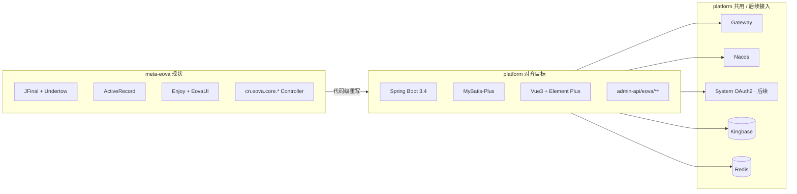

# DES-002 meta-eova 技术栈迁移方案

> 版本：2026-08-29  
> 目标：将 `meta-eova` 从 **JFinal 低代码栈** 迁移到与 `/Users/zhouliwei/git_206/platform` **完全一致** 的技术栈，**功能与设计保持一致**，仅换实现底座。  
> 关联：`docs/DES-001-kingbase-eova-dbs.md`（54321 双库已就绪）

---

## 1. 迁移目标与边界

### 1.1 必须对齐的平台栈（live 口径）

| 维度 | platform 标准 | meta-eova 现状 | 迁移动作 |
|------|---------------|----------------|----------|
| 语言 | Java **17** | Java **8** | 全量升级语法/依赖 |
| 后端框架 | **Spring Boot 3.4.5** + Spring Cloud | **JFinal 5.2.6** | 框架重写 |
| ORM | **MyBatis-Plus 3.5** | JFinal ActiveRecord | Model→DO/Mapper |
| 构建 | **Maven** 多模块 | Maven 多模块 | 模块重组 |
| 微服务 | Gateway + Nacos + 独立 `*-biz`/`*-server` | Undertow 单体 9090 | 新建 `yudao-module-eova` |
| 安全 | Spring Security + OAuth2 Token + SM3 | Session + 拦截器 | **迁移期**保留 EOVA 登录；**后续**再对接 platform System |
| 缓存 | **Redis** + Redisson | EhCache | 替换 |
| 数据库 | **Kingbase 8** + dynamic-datasource | MySQL 双库 `eova`/`main` | 沿用 54321 双库 |
| API 规范 | `CommonResult<T>` + `/admin-api/{module}/**` | JFinal JSON/页面混返 | 统一 REST |
| 前端 | **Vue 3.5 + TS + Vite 5 + Element Plus + Pinia** | Enjoy + Vue3 + EovaUI/Layui | 页面/API 重写 |
| 包名 | `cn.iocoder.yudao.module.*` | `cn.eova.*` | 新包 + 能力映射 |

### 1.2 功能范围（保持一致）

- 元数据引擎：对象/字段/模板/选项/导入导出
- 动态 CRUD：表格/表单/树/上传 Widget
- 菜单/按钮/角色/用户/权限
- 字典、定时任务、Hook/Intercept 扩展点
- Demo 业务样例（hotel/product/users 等）
- 双库模型：`eova_meta`（平台）+ `demo`（业务）

### 1.3 不在本轮范围（迁移后再做）

- Eova Mod 热插拔 ClassLoader（当前 demo 已注释）
- `/router` 签名 API 网关（评估是否并入 Gateway）
- 与 platform AI/Report 模块的深度集成
- 密码算法从 EOVA MD5 批量迁到 SM3（需用户迁移策略）
- **身份并入 platform System**（`eova_user/eova_role` → `system_users/system_role`）
- **eova-ui 嵌入 platform yudao-ui** 路由/菜单整合

### 1.4 目标仓库布局（已定）

```
/Users/zhouliwei/eova/                 # 工作区根（rolling docs + legacy）
├── meta-eova/                         # 原 JFinal 代码，迁移期只读归档
├── remis-eova/                        # ★ remis-eova 仓库（新代码唯一落点）
│   ├── backend/yudao-cloud/           # 后端，结构对齐 platform/backend/yudao-cloud
│   │   └── yudao-module-eova/         # EOVA 模块（*-api + *-biz）
│   └── fornt/eova-ui/                 # 独立前端，技术栈对齐 platform/fornt/yudao-ui
└── docs/                              # 工作区 rolling docs + 迁移方案
```

**约定**：

- **remis-eova 仓库** = 本次迁移的新工程根；前后端均在其下，**不**进 `platform` 主仓。
- Maven **依赖 platform BOM**（`/Users/zhouliwei/git_206/platform/backend/yudao-cloud/yudao-dependencies`），不自造一套版本。
- 后端模块命名遵循 platform 规范（`yudao-module-eova-api` / `yudao-module-eova-biz`）。
- 前端为**独立 `eova-ui`**，目录结构与 platform `yudao-ui` 对齐，后续再谈嵌入整合。

### 1.5 关键决策记录（2026-08-29 已定）

| ID | 决策项 | 结论 |
|----|--------|------|
| DES-002-01 | 落仓 | **remis-eova 仓库**；依赖 platform BOM；不进 platform 主仓 |
| DES-002-02 | 身份 | **先迁移**：继续 `eova_user` / `eova_role` 及 EOVA 权限模型；System 融合**迁移完成后**另开任务 |
| DES-002-03 | 前端 | **先独立** `remis-eova/fornt/eova-ui`；嵌入 yudao-ui **后续**另开任务 |

---

## 2. 架构映射



### 2.1 后端模块切分（建议）

| 新模块 | 对应旧代码 | 说明 |
|--------|-----------|------|
| `yudao-module-eova-api` | `api.sys.*`、对外 DTO | Feign 契约 |
| `yudao-module-eova-biz` | `core/*`、`widget/*`、`meta.api/*`、`service/*` | 主业务 |
| `eova-ui` | `view/webapp/eova/**` | 管理端页面 |

### 2.2 身份与 platform System 关系（分阶段）

| 阶段 | EOVA 能力 | 策略 |
|------|-----------|------|
| **迁移期（当前）** | `eova_user` / `eova_role` | 保留 EOVA 表与权限逻辑；登录/Session/URI 鉴权自洽 |
| **迁移期（当前）** | 菜单 `eova_menu` | 保留 EOVA 菜单树；eova-ui 独立路由 |
| **迁移期（当前）** | 租户/数据权限 | 可先不接 `tenant-id` / `system-code`，或预留 Header 透传 |
| **后续整合** | 用户/角色 | 映射到 `system_users` / `system_role`（另开 DES-003） |
| **后续整合** | 登录 | 改调 platform OAuth2 + SM3（另开 DES-003） |
| **后续整合** | 前端 | eova-ui 嵌入 yudao-ui 路由/菜单（另开 DES-004） |

---

## 3. 分阶段任务规划

### Phase 0 — 治理与设计

| ID | 任务 | 状态 | 产出 |
|----|------|------|------|
| DES-002 | 本迁移方案 | **Done** | 本文档 |
| DES-002-01 | remis-eova 仓库落仓 | **Done** | §1.4 / §1.5 |
| DES-002-02 | 身份策略（先 EOVA 表，后 System） | **Done** | §2.2 迁移期行 |
| DES-002-03 | 前端策略（先独立 eova-ui） | **Done** | §1.4 `fornt/eova-ui` |
| DES-003 | 身份并入 platform System（后续） | **Idea** | 待迁移完成后 |
| DES-004 | eova-ui 嵌入 yudao-ui（后续） | **Idea** | 待 eova-ui 稳定后 |

### Phase 1 — 工程脚手架（预计 3–5 人日）

| ID | 任务 | 状态 | 验收 |
|----|------|------|------|
| LC-001 | 在 `remis-eova/backend/yudao-cloud/` 创建 `yudao-module-eova-api/biz`，parent 对齐 platform BOM | Todo | `mvn compile` 通过 |
| LC-002 | 接入 Nacos、`application-dev.yaml`、服务名 `base-platform-eova-server` | Todo | 注册成功 |
| LC-003 | Gateway 增加 `/admin-api/eova/**` 路由 | Todo | 经 Gateway 可达 |
| LC-004 | dynamic-datasource：`eova_meta`(master) + `demo`(slave 或第二数据源) | Todo | 双库读写 smoke |
| LC-005 | Redis/EhCache 能力替换（配置缓存、Session 废弃） | Todo | 缓存读写 OK |
| LC-006 | 在 `remis-eova/fornt/eova-ui/` 创建独立前端，复制 platform yudao-ui 基座 | Todo | `pnpm dev` 启动 |
| LC-007 | Kingbase 表 DO/Mapper 代码生成（32+25 表） | Todo | 生成物提交 |

### Phase 2 — 数据层（预计 5–8 人日）

| ID | 任务 | 状态 | 验收 |
|----|------|------|------|
| LC-101 | 平台库 32 表 DO + Mapper + 基础 CRUD | Todo | 单表增删改查 |
| LC-102 | 业务库 25 表 DO + Mapper（Demo） | Todo | 单表增删改查 |
| LC-103 | SQL 方言层：`sql/dql`、`sql/ddl` → MyBatis XML/Plus Wrapper | Todo | 原 Meta 查询 SQL 等价 |
| LC-104 | `EovaExp` 表达式引擎移植（独立 jar 或 framework 子模块） | Todo | 单元测试覆盖核心 exp |
| LC-105 | 类型转换器 `Convertor` → 字段渲染/查询类型映射 | Todo | 各 DB 类型映射表 |

### Phase 3 — 核心服务（预计 10–15 人日）

| ID | 任务 | 状态 | 验收 |
|----|------|------|------|
| LC-201 | `MetaService` / `MetaObject` / `MetaField` 元数据读写 | Todo | 导入/同步/覆盖 API 对齐 |
| LC-202 | `WidgetManager` 动态查询/分页/排序/过滤 | Todo | 任意 meta object 列表查询 |
| LC-203 | `FormService` 表单字段集/fieldset/校验 | Todo | add/update 表单 JSON 一致 |
| LC-204 | `AuthService` 菜单树 + URI 权限集 | Todo | 角色菜单与旧版一致 |
| LC-205 | `LoginService` 迁移（eova_user/eova_role 自洽，非 System OAuth2） | Todo | Demo 账号可登录 |
| LC-206 | Hook 机制：`MetaObjectIntercept` → Spring 事件/AOP 扩展 | Todo | Demo Hook 样例可跑 |
| LC-207 | 定时任务 `TaskController` + cron → XXL-Job 或 Spring `@Scheduled` | Todo | 启停任务 |
| LC-208 | Excel 导入导出 `ExcelController` + eec | Todo | 导入导出样例表 |
| LC-209 | 文件上传 `UploadController` → Infra File API 或本地实现 | Todo | 上传/预览 |

### Phase 4 — API 层（预计 8–12 人日）

| ID | 任务 | 状态 | 旧 Controller → 新 Controller |
|----|------|------|--------------------------------|
| LC-301 | 元数据管理 API | Todo | `MetaController` → `MetaAdminController` |
| LC-302 | 菜单 API | Todo | `MenuController` |
| LC-303 | 按钮 API | Todo | `ButtonController` |
| LC-304 | 字典 API | Todo | `DictController` |
| LC-305 | 用户 API | Todo | `UserController` + `UserApi` |
| LC-306 | 角色/授权 API | Todo | `AuthController` + `RoleApi` |
| LC-307 | Widget 表格 API | Todo | `GridController` + `TableController` |
| LC-308 | Widget 表单 API | Todo | `FormController` + `FormControler` |
| LC-309 | Widget 树 API | Todo | `TreeController`（2个合并） |
| LC-310 | Widget 综合 API | Todo | `WidgetController` |
| LC-311 | 模板/单表 API | Todo | `SingleController` + `SingleTemplate` |
| LC-312 | 任务/运维/SSE | Todo | `TaskController` / `OpsController` / `SSEController` |
| LC-313 | 登录/首页 | Todo | `LoginController` / `IndexController` / `HomeController` |
| LC-314 | Admin/Router | Todo | `AdminController` / `RouterController`（评估保留） |

### Phase 5 — 前端（预计 15–25 人日）

| ID | 任务 | 状态 | 旧路径 → 新路径 |
|----|------|------|------------------|
| LC-401 | 登录页 | Todo | `_view/login` → `views/login` |
| LC-402 | 主框架/多 Tab | Todo | `_view/index` + `_block/base.html` |
| LC-403 | 元数据管理 | Todo | `_view/meta/**`（import/override/sync/reorder） |
| LC-404 | 菜单管理 | Todo | `_view/menu/**` |
| LC-405 | 角色授权 | Todo | `_view/role/auth/**` |
| LC-406 | 表格模板 | Todo | `_view/template/table/**` |
| LC-407 | 树模板 | Todo | `_view/template/tree/**` |
| LC-408 | 树表模板 | Todo | `_view/template/tree_table/**` |
| LC-409 | 表单模板 add/update/detail | Todo | `_view/template/form/**` |
| LC-410 | EovaUI 组件 → Element Plus 封装 | Todo | `ui/ext/eova.table.js` 等 |
| LC-411 | 动态 Widget 渲染引擎（Vue3） | Todo | `WidgetManager` 前端对等 |
| LC-412 | Demo 业务页 | Todo | `demo/webapp/**`（hotel/product 等） |
| LC-413 | Axios 适配 `CommonResult` + Token 刷新 | Todo | 对齐 `yudao-ui/service.ts` |

### Phase 6 — 集成与验收（预计 5–8 人日）

| ID | 任务 | 状态 | 验收 |
|----|------|------|------|
| VAL-201 | 双库连通 + 32/25 表数据完整性 | Todo | 与 DES-001 基线一致 |
| VAL-202 | 核心用户旅程：登录→菜单→元数据表 CRUD | Todo | E2E 脚本 |
| VAL-203 | 元数据驱动页：选 object→列表→增删改查 | Todo | 至少 3 个 demo object |
| VAL-204 | 权限：角色按钮/URI 拦截 | Todo | 角色切换验证 |
| VAL-205 | Gateway + Nacos 联调 | Todo | 与 platform 同域部署 |
| VAL-206 | 性能基线：万级 area 表分页 | Todo | P95 可接受 |
| OPS-003 | 切换 JDBC/部署文档 | Todo | `docs/eova-runbook.md` |

---

## 4. 详细迁移清单（代码级）

### 4.1 后端 Java 包迁移矩阵

| 旧包/类 | 行数级 | 新落点 | 优先级 | 状态 |
|---------|--------|--------|--------|------|
| `config/EovaConfig` | 640 | `framework/config` + Spring `@Configuration` | P0 | 0% |
| `config/EovaDataSource` | — | `dynamic-datasource` 配置 | P0 | 0% |
| `widget/WidgetManager` | 745 | `service/widget/WidgetManager` | P0 | 0% |
| `core/meta/MetaController` | 797 | `controller/admin/meta` | P0 | 0% |
| `core/menu/MenuController` | 679 | `controller/admin/menu` | P0 | 0% |
| `engine/EovaExp` + `SqlParse` | — | `framework/exp` | P0 | 0% |
| `sql/dql/*Dialect` | — | `dal/mysql/dialect` 或 XML | P1 | 0% |
| `sql/ddl/*Dialect` | — | `service/meta/ddl` | P1 | 0% |
| `service/LoginService` | — | `service/auth` + OAuth2 适配 | P0 | 0% |
| `service/AuthService` | — | `service/auth` | P0 | 0% |
| `service/MetaService` | — | `service/meta` | P0 | 0% |
| `service/FormService` | — | `service/form` | P0 | 0% |
| `hook/*` + `aop/*` | — | `framework/hook` Spring 扩展 | P1 | 0% |
| `mod/EovaModPlugin` | — | 暂缓/Phase 2 | P3 | 0% |
| `model/*` (18+3) | — | `dal/dataobject/*DO` | P0 | 0% |
| `interceptor/*` (20) | — | Spring Filter/Interceptor | P1 | 0% |
| `plugin/cron4j` | — | XXL-Job | P2 | 0% |
| `common/base/BaseController` | — | 删除，改 `@RestController` | P0 | 0% |

### 4.2 数据表迁移矩阵（平台库 eova_meta — 32 表）

| 表名 | DO | Mapper | Service | Admin API | 前端页 | 状态 |
|------|----|--------|---------|-----------|--------|------|
| eova_object | ☐ | ☐ | ☐ | ☐ | ☐ | 0% |
| eova_field | ☐ | ☐ | ☐ | ☐ | ☐ | 0% |
| eova_field_auth | ☐ | ☐ | ☐ | ☐ | ☐ | 0% |
| eova_field_diy | ☐ | ☐ | ☐ | ☐ | ☐ | 0% |
| eova_menu | ☐ | ☐ | ☐ | ☐ | ☐ | 0% |
| eova_button | ☐ | ☐ | ☐ | ☐ | ☐ | 0% |
| eova_role | ☐ | ☐ | ☐ | ☐ | ☐ | 0% |
| eova_role_btn | ☐ | ☐ | ☐ | ☐ | ☐ | 0% |
| eova_user | ☐ | ☐ | ☐ | ☐ | ☐ | 0% |
| eova_dict | ☐ | ☐ | ☐ | ☐ | ☐ | 0% |
| eova_option | ☐ | ☐ | ☐ | ☐ | ☐ | 0% |
| eova_template | ☐ | ☐ | ☐ | ☐ | ☐ | 0% |
| eova_widget | ☐ | ☐ | ☐ | ☐ | ☐ | 0% |
| eova_config | ☐ | ☐ | ☐ | ☐ | ☐ | 0% |
| eova_props | ☐ | ☐ | ☐ | ☐ | ☐ | 0% |
| eova_cache | ☐ | ☐ | ☐ | — | — | 0% |
| eova_log | ☐ | ☐ | ☐ | ☐ | ☐ | 0% |
| eova_login_log | ☐ | ☐ | ☐ | ☐ | ☐ | 0% |
| eova_task | ☐ | ☐ | ☐ | ☐ | ☐ | 0% |
| eova_file | ☐ | ☐ | ☐ | ☐ | ☐ | 0% |
| eova_import | ☐ | ☐ | ☐ | ☐ | ☐ | 0% |
| eova_import_template | ☐ | ☐ | ☐ | ☐ | ☐ | 0% |
| eova_msg | ☐ | ☐ | ☐ | ☐ | ☐ | 0% |
| eova_news | ☐ | ☐ | ☐ | ☐ | ☐ | 0% |
| eova_notice | ☐ | ☐ | ☐ | ☐ | ☐ | 0% |
| eova_org | ☐ | ☐ | ☐ | ☐ | ☐ | 0% |
| eova_session | ☐ | ☐ | — | — | — | 0% |
| eova_sms | ☐ | ☐ | ☐ | ☐ | ☐ | 0% |
| eova_mod | ☐ | ☐ | ☐ | ☐ | ☐ | 0% |
| eova_diy | ☐ | ☐ | ☐ | ☐ | ☐ | 0% |
| eova_biz_object | ☐ | ☐ | ☐ | ☐ | ☐ | 0% |
| eova_exception | ☐ | ☐ | ☐ | ☐ | ☐ | 0% |

### 4.3 数据表迁移矩阵（业务库 demo — 25 表）

| 表名 | 动态 CRUD | Demo 页 | 状态 |
|------|-----------|---------|------|
| users / user_info / users_exp / users_item | ☐ | ☐ | 0% |
| area / area_city | ☐ | ☐ | 0% |
| address | ☐ | ☐ | 0% |
| product / goods_cat / goods_style | ☐ | ☐ | 0% |
| hotel / hotel_bed / hotel_stock | ☐ | ☐ | 0% |
| orders / order_item / orderss | ☐ | ☐ | 0% |
| item / links / dicts | ☐ | ☐ | 0% |
| sale_data / data_login / data_money / data_10 | ☐ | ☐ | 0% |
| test_info / my_file | ☐ | ☐ | 0% |

### 4.4 前端页面迁移矩阵

| 区域 | 文件约数 | 新实现 | 状态 |
|------|----------|--------|------|
| 登录/首页 | ~5 | Vue SFC + EP | 0% |
| 元数据 meta | ~15 | Vue SFC | 0% |
| 菜单 menu | ~8 | Vue SFC | 0% |
| 角色 role | ~3 | Vue SFC | 0% |
| 模板 table/tree/form | ~25 | 动态组件 | 0% |
| EovaUI 扩展 JS | ~10 | composable + EP 表格 | 0% |
| Demo 自定义页 | ~10 | 业务 views | 0% |
| 静态 lib (vue/layui) | — | 删除，用 npm 依赖 | 0% |

---

## 5. 关键技术难点与对策

| 难点 | 说明 | 对策 |
|------|------|------|
| **元数据驱动 UI** | 旧版服务端 Enjoy + 前端 EovaUI 强耦合 | 先定 **Meta JSON 协议** 不变，前后端各实现一层适配 |
| **WidgetManager** | 745 行动态 SQL/权限/树 | 拆为 QueryBuilder + PermissionFilter + TreeBuilder 三个 Service |
| **双库** | `Ds.EOVA` / `Ds.MAIN` 硬编码 | `@DS("eova_meta")` / `@DS("demo")` 注解 |
| **表达式 EovaExp** | 贯穿字段/按钮/菜单 | 优先原样移植为纯 Java 库，少改语法 |
| **权限模型** | URI 集合 + 按钮 auth 码 | 映射 `@PreAuthorize` + 自定义 `EovaPermissionService` |
| **密码** | EOVA MD5 vs Platform SM3 | 登录兼容层：识别旧 hash 并提示重置 |
| **Enjoy 模板** | 无直接等价 | 全部改为 Vue 路由组件 |

---

## 6. 迁移进度总览

> 更新规则：每完成一项，同步改 `docs/ai-task-board.md` 与本节百分比。

| 阶段 | 任务数 | 已完成 | 进度 | 状态 |
|------|--------|--------|------|------|
| Phase 0 设计 | 6 | 4 | **67%** | Done（DES-003/004 为后续） |
| Phase 1 脚手架 | 7 | 0 | **0%** | **LC-001 Ready** |
| Phase 2 数据层 | 5 | 0 | **0%** | 未开始 |
| Phase 3 核心服务 | 9 | 0 | **0%** | 未开始 |
| Phase 4 API | 14 | 0 | **0%** | 未开始 |
| Phase 5 前端 | 13 | 0 | **0%** | 未开始 |
| Phase 6 验收 | 7 | 0 | **0%** | 未开始 |
| **合计** | **61** | **4** | **≈7%** | — |

### 6.1 里程碑

| 里程碑 | 目标日期（待定） | 标志 |
|--------|------------------|------|
| M0 | — | DES-002 方案评审通过 |
| M1 | — | 后端空壳 + 双库连通 + Gateway 路由 |
| M2 | — | 元数据 CRUD API 对齐 |
| M3 | — | 动态表格/表单 Widget 可用 |
| M4 | — | 前端主流程可演示 |
| M5 | — | Demo 业务 + VAL 全通过 |

---

## 7. 推荐执行顺序（单线程 In Progress）

```
DES-002 决策已全部落定
  → LC-001~007 脚手架（remis-eova/backend + remis-eova/fornt/eova-ui）
  → LC-101~105 数据层 + EovaExp
  → LC-201~202 Meta + Widget（核心）
  → LC-301~310 API
  → LC-401~411 前端框架 + 动态组件
  → LC-204~205 EOVA 权限/登录（非 System）
  → LC-412 Demo + VAL-201~206
  → （后续）DES-003 身份整合 + DES-004 前端嵌入
```

同一时刻只允许 **1** 个 `In Progress` 任务（rolling governance）。

---

## 8. 决策状态（2026-08-29 全部落定）

| 项 | 结论 |
|----|------|
| **落仓** | **remis-eova 仓库**（`/Users/zhouliwei/eova/remis-eova/`），依赖 platform BOM，不进 platform 主仓 |
| **身份** | **先迁移** `eova_user/eova_role`；System 融合 → **DES-003（后续）** |
| **前端** | **先独立** `remis-eova/fornt/eova-ui`；嵌入 yudao-ui → **DES-004（后续）** |

**LC-001 已可进入 Ready，待拿哥一句「开干脚手架」即执行。**
