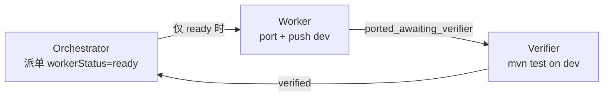

# EOVA 迁移 — Cursor Automations 三层流水线（v2）

> 模式：**Orchestrator → Worker → Verifier**（**串行**，Manual Run 优先）  
> 原则：一次 1 单元；代码 **直接 push dev**；禁止 `cursor/*` 与 Draft PR。

---

## 1. 架构

| 角色 | 职责 | 写代码？ |
|------|------|----------|
| Orchestrator | 读任务板 + 单元队列，写并提交 `automation/` 控制面 JSON | 否 |
| Worker | port 1 单元，先 push 业务代码再写并 push `automation/` 结果 | 是 |
| Verifier | 在确切 Worker commit 上验证，写并提交 `automation/` 结果 | 否 |

---

## 2. 仓库与分支

| 项 | 值 |
|----|-----|
| GitHub（Automation 主） | `https://github.com/zlw123/tky-eova.git` |
| 分支 | **dev**（业务代码与 `automation/` 控制面同分支，按目录隔离） |
| GitLab（内网备份） | `http://10.20.110.206:45001/remis/modules/remis-eova.git` |

---

## 3. 文档索引

| 文件 | 用途 |
|------|------|
| **`PROMPTS.md`** | **复制到 Cursor UI 的三段 Instructions（首选）** |
| `unit-queue-index.md` | **按 taskId 路由**单元队列（LC-011 / FE-001 / FE-002） |
| `orchestrator-instructions.md` | Orchestrator 完整规则 |
| `worker-instructions.md` | Worker 完整规则 |
| `verifier-instructions.md` | Verifier 完整规则 |
| `LC-011-unit-queue.md` | 仅 LC-011 的后端 engine 顺序 |
| `MANUAL-SETUP.md` | 手建 Automation 步骤 |
| `CLOUD-AGENT-SETUP.md` | Cloud 环境挂库 |
| `prefill-workflows.json` | Agent 预填草稿 |
| `../DES-002-R2-migration-execution-design.md` | 代码级迁移单元、适配、证据和状态总设计 |
| `../DES-API-R2.md` / `../DES-ADAPTER-R2.md` | API 基线与非数据库旧底座适配设计 |
| `../DES-DB-ADAPTER.md` / `../DES-ENV-R2.md` | 数据库适配与验证环境设计 |
| `../DES-BOUNDARY-R2.md` | D 类胶水等价替换边界设计 |

---

## 4. 触发器（R3 推荐）

| 自动化 | 触发 | 说明 |
|--------|------|------|
| R3 评审前三条 | **Manual Run** | 只做 workspace persistence probe，不派业务单元 |
| Orchestrator | 放行后：Weekdays 09:00（Asia/Shanghai） | 每天最多一次，禁止 `*/7` |
| Worker | 放行后：Weekdays 10:00（Asia/Shanghai） | 读取 `workerStatus=ready`，否则 no-op |
| Verifier | 放行后：GitHub `New push to branch=dev` + Weekdays 14:00（Asia/Shanghai）兜底 | 即时验证 Worker push；Schedule 防止事件丢失 |

Orchestrator 和 Worker 仍只用错峰 Schedule；只有 Verifier 使用 `New push to branch=dev`，并保留每日 Schedule 兜底。禁止 Worker 监听自己的 push，禁止 PR/Draft/review 事件触发迁移，禁止并行 Worker/Verifier。每个迁移单元应控制在 30 分钟 lease 内；超出范围先拆分单元，不通过提高调度频率规避 lease。

---

## 5. 控制面与 workerStatus 状态机

机器状态事实源是仓库根目录 `automation/`：`state/current.json`、`queue/units.json`、`runs/index.json` 和 `runs/<runId>/`。本地 `docs/session-current.md`、`docs/session-handoff.md`、`docs/ai-task-board.md`、`docs/.local/` 只作本地治理视图，不作为云端跨 run 共享存储。

| 值 | 谁可跑 |
|----|--------|
| `ready` | 仅 Worker |
| `ported_awaiting_verifier` | 仅 Verifier |
| `verified` | 仅 Orchestrator（派下一单元） |
| `blocked` | 仅人工 |

---

## 6. 2026-08-29 事故复盘

Automation cron 过密 + Worker 开 Draft PR 未 merge → 14 条 `cursor/*` 分支、dev 无代码。  
已人工 merge PR #7 并清分支。该段仅为历史记录；当前 v2 规则见 `PROMPTS.md`，治理文档按 `AGENTS.md` 只本地维护。
