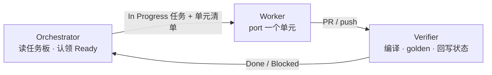

# EOVA 迁移 — Cursor Automations 三层流水线

> 模式：**Orchestrator → Worker → Verifier**  
> 原则：一次只推进 **1 个迁移单元**（1 个 Java 类 / 1 个 JS 模块），严格遵循 DES-002-R1 / R1-F。

---

## 1. 架构

| 自动化 | 职责 | 不写业务代码？ |
|--------|------|----------------|
| **Orchestrator** | 读 `docs/ai-task-board.md`，将 **1 个** Ready 任务置为 In Progress，更新 rolling docs，产出本 run 的 **单元清单**（最多 1 个文件） | 是 |
| **Worker** | 按清单从 `meta-eova/` port 到 `remis-eova/`，遵守 R1/R1-F | 否（唯一写代码的层） |
| **Verifier** | `mvn compile` / `pnpm build`、golden diff、更新任务状态 Blocked/Done | 是 |

---

## 2. 前置条件（必须先做）

1. **Git 仓库**：在 `/Users/zhouliwei/eova` 初始化 git 并 push 到  
   `http://10.20.110.206:45001/remis/modules/remis-eova.git`（步骤见 `docs/AUTO-002-git-bootstrap.md`）。
2. **提交本目录**：`docs/automation/*` 与 rolling docs 必须已 commit 到 automation 运行的分支。
3. **Cloud Agent**：在 [Cloud Agents 控制台](https://cursor.com/dashboard?tab=cloud-agents) 开启，Worker 建议用 Cloud 算力。
4. **试点任务**：首跑建议 **LC-011**（后端 `EovaExp`）→ 验证通过后 **FE-002**（契约层）。

---

## 3. 触发器建议

| 自动化 | 推荐触发 | 说明 |
|--------|----------|------|
| Orchestrator | 定时：工作日 09:00 | 认领任务；也可改为手动 Webhook |
| Worker | 定时：工作日 09:30 | 在 Orchestrator 之后；或 PR 合并 orchestrator 分支后 |
| Verifier | PR 有新 push | 对 Worker 产出的 PR 做验证 |

同一时刻任务板只允许 **1 个 In Progress**（与 `ai-task-board.md` 规则一致）。

---

## 4. 指令文件

| 文件 | 用途 |
|------|------|
| `orchestrator-instructions.md` | Orchestrator 完整 prompt |
| `worker-instructions.md` | Worker 完整 prompt（LC-* / FE-* 路由） |
| `verifier-instructions.md` | Verifier 完整 prompt |
| `prefill-workflows.json` | 三条 Automation 的编辑器预填草稿（Agents Window 导入用） |

---

## 5. 人工闸门（Automation 不会自动跳过）

- DES-002-R2 / R2-F 对照表未完成前，Worker **只跑试点单元**（白名单见 worker-instructions）。
- 身份（DES-003）、嵌入 yudao-ui（DES-004）、Yudao 空壳（LC-001）**禁止** Worker 擅自启动。
- golden baseline 缺失时，Verifier 只跑编译，不判 Done。

---

## 6. 首跑检查清单

- [ ] `eova` 根目录已是 git 仓库且 remote 已配置
- [ ] `docs/automation/` 已 push
- [ ] 三条 Automation 已在 Cursor Automations UI 创建并启用
- [ ] Orchestrator 跑完：`LC-011` 为 In Progress，session-current 已更新
- [ ] Worker 跑完：`remis-eova/` 出现首个 port 文件 + traceability 注释
- [ ] Verifier 跑完：编译通过或任务标 Blocked 并写原因
