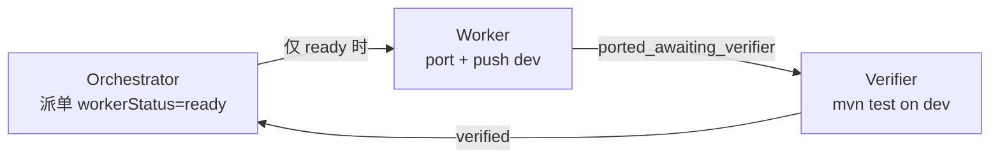

# EOVA 迁移 — Cursor Automations 三层流水线（v2）

> 模式：**Orchestrator → Worker → Verifier**（**串行**，Manual Run 优先）  
> 原则：一次 1 单元；代码 **直接 push dev**；禁止 `cursor/*` 与 Draft PR。

---

## 1. 架构

| 角色 | 职责 | 写代码？ |
|------|------|----------|
| Orchestrator | 读任务板 + `LC-011-unit-queue`，写 Worker JSON | 否 |
| Worker | port 1 单元，push **dev** | 是 |
| Verifier | dev 上 mvn test，标 verified/blocked | 否 |

---

## 2. 仓库与分支

| 项 | 值 |
|----|-----|
| GitHub（Automation 主） | `https://github.com/zlw123/tky-eova` |
| 分支 | **dev** |
| GitLab（内网备份） | `remis/modules/remis-eova` |

---

## 3. 文档索引

| 文件 | 用途 |
|------|------|
| **`PROMPTS.md`** | **复制到 Cursor UI 的三段 Instructions（首选）** |
| `orchestrator-instructions.md` | Orchestrator 完整规则 |
| `worker-instructions.md` | Worker 完整规则 |
| `verifier-instructions.md` | Verifier 完整规则 |
| `LC-011-unit-queue.md` | LC-011 派单顺序与已 port 清单 |
| `MANUAL-SETUP.md` | 手建 Automation 步骤 |
| `CLOUD-AGENT-SETUP.md` | Cloud 环境挂库 |
| `prefill-workflows.json` | Agent 预填草稿 |

---

## 4. 触发器（v2 推荐）

| 自动化 | 触发 | 说明 |
|--------|------|------|
| 三条 | **Manual Run** | 稳定前唯一推荐 |
| Orchestrator | 可选：工作日 09:00 **≤1 次/天** | 禁止 `*/7` |
| Worker / Verifier | **仅人工**在上一环完成后 | 禁止 cron 并行 |

---

## 5. workerStatus 状态机

| 值 | 谁可跑 |
|----|--------|
| `ready` | 仅 Worker |
| `ported_awaiting_verifier` | 仅 Verifier |
| `verified` | 仅 Orchestrator（派下一单元） |
| `blocked` | 仅人工 |

---

## 6. 2026-08-29 事故复盘

Automation cron 过密 + Worker 开 Draft PR 未 merge → 14 条 `cursor/*` 分支、dev 无代码。  
已人工 merge PR #7 并清分支。**v2 规则见 `PROMPTS.md` 末表。**
